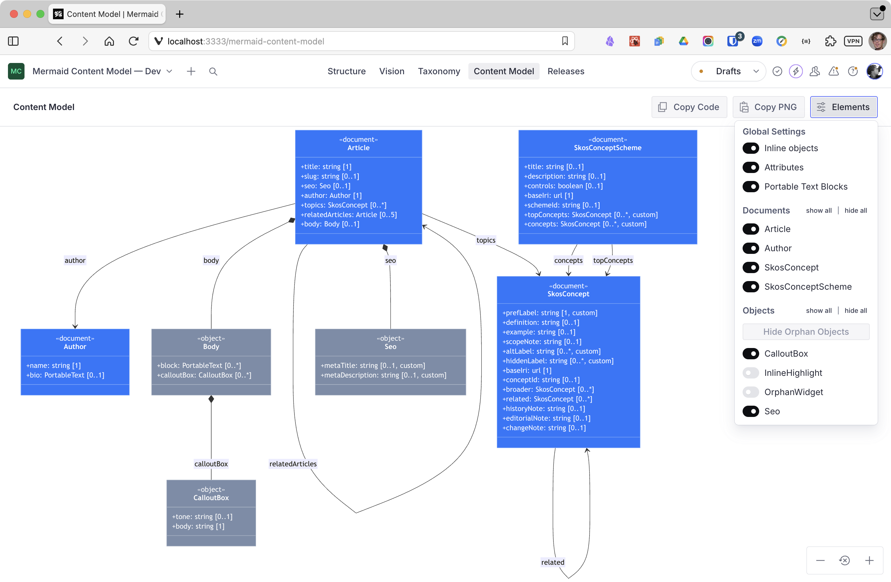

# Sanity Mermaid Content Model

[](https://www.npmjs.com/package/sanity-plugin-mermaid-content-model)
[](https://github.com/andybywire/sanity-plugin-mermaid-content-model/actions/workflows/main.yml)
[](https://github.com/andybywire/sanity-plugin-mermaid-content-model/blob/main/LICENSE)
[](https://github.com/semantic-release/semantic-release)

### Render Sanity content models as [Mermaid](https://mermaid.js.org/) class diagrams inside Studio. 

You probably created a visual representation of your content model at some point in your Studio design process. Is it still accurate? The Mermaid Content Model plug-in provides an up-to-date view of the _actual_ structure of a Sanity project's content model. Use it to understand and communicate the current state of your content model, identify model drift and doc rot, and mitigate the unintended consequences of iterating a content model over time. 




## Features
- Document and object types are derived from the Studio compiled schema, so types contributed by other plugins are included in the graph.
- Attribute cardinality is captured from the compiled scheme and displayed in the model: requirement, min-count, and max-count are supported. 
- Custom attribute validation rules are indicated by a "custom" denotation next to cardinality constraints.
- Document and object visibility can be modified using the "Elements" options, allowing you to focus on particular parts of your model and identify shared attribute duplication and orphan objects.
- Customized models can be copied as a PNG or as Mermaid code, allowing you to edit or further transform the document in interoperable Mermaid editors like [Mermaid.ai](https://mermaid.ai), [Mermaid Viewer](https://mermaidviewer.com), and [Mermalaid](https://www.mermalaid.com).

## Installation
```
npm install sanity-plugin-mermaid-content-model
# or
pnpm add sanity-plugin-mermaid-content-model
# or
yarn add sanity-plugin-mermaid-content-model
```

## Usage

Add the plugin to your Studio config and open the **Content Model** tool from the top navigation:

```ts
// sanity.config.ts
import {defineConfig} from 'sanity'
import {mermaidContentModel} from 'sanity-plugin-mermaid-content-model'

export default defineConfig({
  // ...
  plugins: [mermaidContentModel()],
})
```

## License

[MIT](LICENSE) © Andy Fitzgerald

## Development

This repo bundles a dev Studio as a workspace member (`studio/`). Run it and open the **Content Model** tool:

```
pnpm dev
```

### Scripts

| Script            | Purpose                                 |
| ----------------- | --------------------------------------- |
| `pnpm test`       | Run the Vitest suite once.              |
| `pnpm test:watch` | Watch mode.                             |
| `pnpm typecheck`  | `tsc --noEmit` against `src` + configs. |
| `pnpm build`      | Build `dist/` with `@sanity/pkg-utils`. |


- See [UI Design](docs/ui-design.md) and [Architecture](docs/architecture.md) docs for details on plugin design intent and functional composition. 
- See [Testing a plugin in Sanity Studio](https://github.com/sanity-io/plugin-kit#testing-a-plugin-in-sanity-studio)
for instructions on how to run this plugin with hot-reload in a standalone studio.