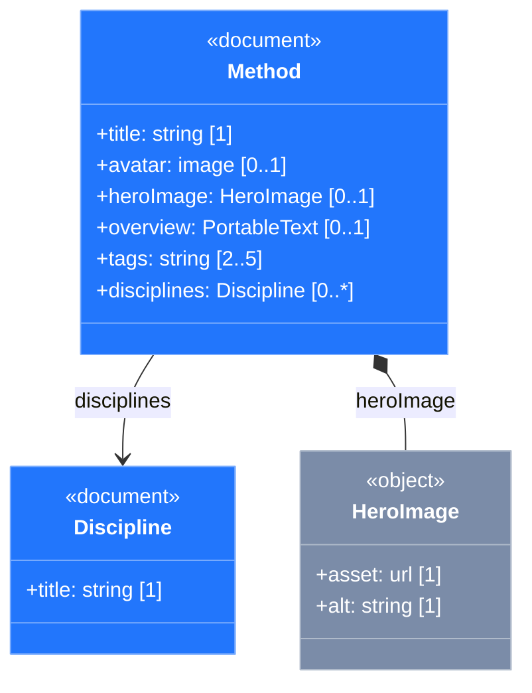

# Architecture

How the plugin turns a Sanity Studio schema into a Mermaid `classDiagram`, and the contract that mapping follows. This is the working reference for contributors (human or AI-assisted) on the rendering pipeline.

The decisions behind it — why a Mermaid class diagram, and why an in-Studio plugin that reads the composed schema — are recorded in [ADR 0001 (the export contract)](decisions/0001-content-model-mermaid-export.md) and [ADR 0002 (in-Studio plugin form + schema source)](decisions/0002-content-model-plugin-architecture.md). This document is the living restatement of the contract; the ADRs are the deeper "why."

## Why a Mermaid class diagram

Sanity models two genuinely different kinds of thing: **documents** (entities with their own identity and top-level URL) and **objects** (compositional values, always embedded in something else). Mermaid's `classDiagram` is purpose-built to show exactly this: stereotypes mark the document/object distinction, composition diamonds mark embedded objects, association arrows mark references, cardinality sits on the lines, and `classDef` styles each stereotype. (An earlier OWL/RDFS attempt flattened the document/object distinction into a single class hierarchy — a paradigm mismatch. See [ADR 0001](decisions/0001-content-model-mermaid-export.md).) The emitted Mermaid is also designed to be **portable** — it should render in any Mermaid host (mermaid.live, GitHub, etc.) without app-specific config.

## Pipeline

A pure transform chain with a single impure seam at each end (reading the schema, rendering to the DOM):

```
useSchema()  →  readSchemaSource  →  walk  →  filterModel  →  emit  →  MermaidView
 (Studio)        schema-adapter      walker   filter-model    emit-     (SVG render)
                                       │                       mermaid
                                       └── probe (validation introspection)
```

- **`probe.ts`** — Proxy-based introspection of a field's `validation` function. Records every `Rule.*` call *without importing Sanity's Rule class* (coupled to method names only), returning `{required, min, max, hasCustom, hasOtherConstraints}`. This is what recovers real cardinality.
- **`walker.ts`** — Walks the raw `defineType`-shaped schema array and produces a **`CanonicalModel`** (`{classes, edges, warnings}`). Uses the probe for cardinality; handles type-name skips, inline-alias resolution, image/file fields (scalar leaf vs. promoted class), inline-anonymous-object naming, edge filtering, and collision warnings.
- **`filter-model.ts`** — A *pure* transform of the `CanonicalModel`, applied **between** `walk` and `emit`, that drops hidden classes/edges per the Elements selection. Filtering never lives in the walker or emitter. (`elements.ts` computes the selection: reachability, orphans, dependent-object resolution.)
- **`emit-mermaid.ts`** — Renders a `CanonicalModel` to a Mermaid `classDiagram` string. Pure; no I/O. "Attributes" toggle and theme palette are `emit` **options**, not post-processing.
- **`build-diagram.ts`** — Orchestrates `readSchemaSource → walk → (filter) → emit`, returning a `DiagramResult`.
- **`schema-adapter.ts`** / **`tool/`** — the two impure seams (read Studio's schema; render/clipboard/toasts). Kept thin (see [ui-design.md](ui-design.md) guardrails).

The **`CanonicalModel` is the seam**: everything upstream produces it, everything downstream consumes it. New capabilities should extend the model or its pure transforms, not thread schema details into the component layer.

## Reading the schema (the host seam)

The adapter (`readSchemaSource` in `schema-adapter.ts`) reads **`useSchema()._original.types`** — the raw, authored `defineType` array, merged from Studio config **and every plugin**, with `validation` functions still intact. That combination (raw + validation-preserving + plugin-aware) is what lets the probe recover full cardinality *and* see plugin-contributed types like `skosConcept`.

Two rejected alternatives:
- **Compiled `get()` / `getTypeNames()` (public API)** — sees all plugin types, but validation is already resolved to specs, so the probe can't introspect it and cardinality degrades.
- **Importing `schemaTypes/index.ts` directly (the CLI's path)** — raw + validation intact, but blind to plugin-contributed types.

`_original` is tagged `@internal`, so the adapter **guards** the access and degrades gracefully (a missing/non-array `_original.types` yields an empty result + a human-readable warning, never a crash or silent blank). The dependency is isolated to that one ~4-line function. Full risk analysis in [ADR 0002](decisions/0002-content-model-plugin-architecture.md). Re-verify the access when widening the `sanity` peer range.

## The mapping contract (Sanity → Mermaid `classDiagram`)

### Stereotypes & styling
- **Document types:** `<<document>>` annotation in the class body; blue via `classDef document fill:#2276FC,stroke:#7AACFD,color:#fff`.
- **Object types:** `<<object>>` annotation; slate via `classDef object fill:#7B8CA8,stroke:#AFBACA,color:#fff`.
- Styling is applied **at the class declaration** with Mermaid's `:::` operator: `class Method:::document { … }`. The annotation produces the visible `«document»` label; the `:::stereotype` produces the colour. **Both are needed.**
- **Trap — phantom class:** a standalone `class Name stereotype` line (no `:::`) is parsed as a *new* class with the concatenated name (`Methoddocument`), rendering an extra empty box. Declare each class exactly once, with `:::stereotype` at the declaration site; never emit separate style-assignment lines.
- **Trap — classDef placement:** emit `classDef` lines at the **end**, after all classes and edges. The parser tolerates either order, but some viewers (mermaidviewer.com) drop fills when `classDef` precedes the classes that reference it. Bottom-placement renders consistently everywhere.

### Fields & relationships
- **Primitive field** → `+fieldName: type [cardinality]` in the class body.
- **Object field** (named composition target or inline anonymous object) → field line **plus** a composition edge `Parent *-- Child` (filled diamond).
- **Reference field** → field line **plus** an association edge `Parent --> Target` (arrow).
- **Portable Text** → depends on contents: **block-only** PT is a scalar label (`+overview: PortableText [0..1]`), no class/edge; PT that **also** carries class-able embeds is promoted to its own class (see *Portable Text* below).
- **Image & file fields** → shape-dependent (`file` follows `image` throughout):
  - A **named top-level** image/file type (`defineType({type: 'image', …})`) is an object-stereotype class (origin `image`/`file`), with a synthetic `+asset: url [1]` **prepended** (so the primary content is explicit); Sanity-internal `hotspot`/`crop`/`media` are skipped; user fields follow in declaration order. A field referencing it composes in (`Parent *-- HeroImage`).
  - A **bare inline** image/file field (`{name: 'avatar', type: 'image'}`, no authored sub-fields) is a **scalar leaf** — `+avatar: image [0..1]` (label `image`/`file`), no class, no edge: the field holds an asset, not an author-defined object. An array of them is the same leaf with array cardinality (`+gallery: image [0..*]`).
  - An **inline** image/file **with its own authored sub-fields** (e.g. `alt`/`caption`) is **promoted** to an object-stereotype class with origin `inline` — synthetic `+asset: url [1]` lead plus those fields — and a composition edge, under the same naming/collision policy as an inline anonymous object. (The image-internal `hotspot`/`crop`/`media` don't count as authored sub-fields, so an image carrying only those stays a scalar leaf.)
- **Inline anonymous object** → its own object-stereotype class. Naming: bare `pascalCase(fieldName)` unless it collides with a named class or another field-derived object of the same name, in which case all colliding ones are **qualified by their parent, base-first** (`Metadata_Method`, `Metadata_Discipline`), with one warning per collision group in `model.warnings`. Base-first keeps the base name readable; the `_` separator can never clash with a real type's class name, since `pascalCase` strips `_`/`-`/`.` and so never emits one. The same rule disambiguates colliding **structural Portable Text fields** (two `body` fields → `Body_Article` / `Body_Page`) — see [Portable Text](#portable-text).
- **Custom-validator marker** → `[…, custom]` appended to a field's cardinality when validation can't be fully rendered: `Rule.custom(…)`, other constraints (regex/email/unique/length/…), or `Rule.min/max` on a non-array (value bounds, not cardinality).

### Portable Text

A Portable Text array maps one of two ways, by what it contains:

- **Block-only** (`of: [{type: 'block'}]` — the common `overview`/`body` prose field) → a scalar `+field: PortableText [0..1]` label. No class, no edge; the prose is one opaque value.
- **Structural** (a `block` member **plus** ≥1 surfaced non-block member — a class-able embed, or a bare image/file leaf) → promoted to its own `«object»` class (origin `portableText`), carrying a synthetic `+block: PortableText [0..*]` field for the prose plus one field per surfaced member. Class-able embeds also get a composition/reference edge, so the relationship is **two-hop** — `Parent *-- BodyClass *-- Embed` — keeping embedded types connected instead of orphaned.

Embeds are gathered from **all three positions** an embed can occupy, each becoming a composition (object) or association (reference) edge from the PT class:
- **top-level `of` members** — block-level inserts (a `calloutBox`, a `bodyImage`, a reference);
- **a block's inline `of`** — inline objects within the text (an `inlineHighlight`);
- **`marks.annotations`** — objects/references decorating a span (a `link`).

A **named** embed composes to (or references) that type's class, labeled by the member's own `name` when present (`{name: 'pre', type: 'code'}` → a `pre` field) and otherwise by the type name. If that `type` is itself a named alias (`richTableBlock` → `richTable`), it's followed to the base class first (see *Type-name skips & resolution*) — issue #32. An embed **declared inline** becomes its own class with origin `inline`, under the same naming/collision policy as inline anonymous objects — so it follows the Elements menu's "inline objects" toggle. This covers inline objects/annotations (`{name, type: 'object', fields}`, e.g. a `link`) **and inline image/file members carrying their own sub-fields** (`{type: 'image', fields}` — these get the synthetic `+asset: url [1]` lead, and fall back to the type name when the member is nameless). Because `image`/`file` are intrinsic primitive types, the inline-composite check runs before the primitive short-circuit. A *bare* image/file member (no authored sub-fields) isn't class-able, but it still surfaces as a scalar `image`/`file` **leaf field** on the PT class (no class, no edge) — and counts as a surfaced member, so a `[{block}, {image}]` field promotes to reveal the image rather than collapsing to an opaque scalar.

Promotion keys on **explicitly-authored** embeds only: a bare `{type: 'block'}` carries no marks/`of` in the raw authored schema (Sanity's default `link`/decorators live only in the *compiled* type — see [ADR 0002](decisions/0002-content-model-plugin-architecture.md)), so ordinary prose fields stay scalar.

### Cardinality
Derived from `Rule.required()` + array status, refined by array `Rule.min`/`Rule.max`:

| required | array | extra | cardinality |
|---|---|---|---|
| no | no | — | `0..1` |
| yes | no | — | `1` |
| no | yes | — | `0..*` |
| yes | yes | — | `1..*` |
| — | yes | `Rule.min(n)` | `n..*` |
| — | yes | `Rule.max(m)` | `0..m` |
| — | yes | `Rule.min(n).max(m)` | `n..m` |

Cardinality here is **information design, not runtime validation** — the diagram is not a constraint surface.

### Type-name skips & resolution
- **Skip patterns:** `/^sanity\./`, `/^assist\./`, `/^geopoint$/`. Matching top-level types are dropped; references pointing at them drop the edge **plus a warning**, so the diagram stays honest about what's filtered.
- **Inline-alias resolution:** a top-level `reference` type (`defineType({name: 'referencedDiscipline', type: 'reference', to: [{type: 'discipline'}]})`) is followed through to its target (`Discipline`) rather than emitted as its own class. The same mechanism resolves named-class composition.
- **Named-type aliases (type extension):** a top-level type whose `type` is *the name of another registered type* — Sanity's type-extension feature, e.g. the rich-table plugin's `defineType({name: 'richTableBlock', type: 'richTable'})` — is followed through the alias chain (cycle-guarded) to the underlying definition the diagram actually emits. A field, array member, or Portable Text embed referencing `richTableBlock` then composes to the `RichTable` class instead of dropping silently and stranding it as an orphan (issue #32). The chain bottoms out at its base: a document/object/image/file → composition to that class; a primitive → that primitive's leaf; a reference/array alias → resolved as above. The alias itself is never emitted as a separate class.
- **`slug`** is treated as `string` at field sites; no class emitted.
- **Platform metadata fields** are skipped: `_id`, `_type`, `_createdAt`, `_updatedAt`, `_rev`, `_key`, `_weak`.

### Validation — partially represented
Reflected: `Rule.required()`, array `Rule.min/max`, and the *presence* of `Rule.custom()` / other constraints (via the cardinality column + `custom` marker). **Not** represented: the *bodies* of custom validators, severity (`warning` vs `error`), `hidden`/`readOnly`/`initialValue`, conditional fields, custom inputs.

Separately from validation, the walker surfaces **non-blocking modeling-smell warnings** (name collisions, reused field names with different shapes, dropped edges) into `model.warnings` for the "Potential Issues" menu — cataloged in [warnings.md](warnings.md).

### Visual grouping
Mermaid `classDiagram` has no `subgraph`. The document-vs-object grouping is conveyed implicitly through stereotype fill colour; no `direction` hint is added.

## Sample output

````markdown

````

## Origins

The pure modules — `probe`, `walker`, `emit-mermaid` — began life in a content-model **CLI** that loaded a Studio's `schemaTypes/index.ts` directly. That CLI had one hard limitation: a direct import is **blind to plugin-contributed types** (e.g. `skosConcept` from `sanity-plugin-taxonomy-manager`), which are registered at plugin-init time. Running the same walker/emit **inside Studio** against `useSchema()` surfaces the fully-composed schema — the reason this plugin exists (see [ADR 0002](decisions/0002-content-model-plugin-architecture.md)).

That CLI has since been retired, so **this plugin is now the sole, canonical implementation** of the content-model export — its own test suite is authoritative. The vocabulary-mapping contract documented above is the spec (recorded in [ADR 0001](decisions/0001-content-model-mermaid-export.md)).
